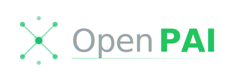

<div align="center">

<picture>
  <source media="(prefers-color-scheme: dark)" srcset="./images/openpai-logo-dark.svg">
  <source media="(prefers-color-scheme: light)" srcset="./images/openpai-logo.svg">
  
</picture>

<br/>
<br/>

# OpenPAI

### A free, open-source fork of [Personal AI Infrastructure](https://github.com/danielmiessler/Personal_AI_Infrastructure)

Created by **[Daniel Miessler](https://danielmiessler.com)** and the PAI community.

<br/>

[](https://opencode.ai)
[](https://www.typescriptlang.org/)
[](https://bun.sh)
[](LICENSE)

</div>

---

## Why This Fork?

[PAI](https://github.com/danielmiessler/Personal_AI_Infrastructure) is an incredible system for personal AI infrastructure — memory, skills, agents, self-improvement loops, and more. Daniel Miessler and the community built something genuinely unique.

**OpenPAI makes one change: remove all paid dependencies.**

The original PAI requires Claude Code (paid) and ElevenLabs TTS (paid API). OpenPAI replaces these with free, open-source alternatives so anyone can run the full PAI stack at zero cost.

Same skills. Same agents. Same philosophy. Zero paid API dependencies.

---

## What's Different

| Original PAI | OpenPAI |
|---|---|
| [Claude Code](https://claude.ai/code) (paid) | [OpenCode](https://opencode.ai) (free, open-source) |
| [ElevenLabs](https://elevenlabs.io) TTS (paid API) | [Kokoro 82M](https://github.com/hexgrad/kokoro) (local, free) |
| Hooks system | Plugins system (OpenCode native) |
| `~/.claude/` config | `~/.config/openpai/` config |
| `CLAUDE.md` | `AGENTS.md` |
| `settings.json` | `opencode.json` |

Everything else — the skill system, memory architecture, TELOS framework, agents, algorithms, security model — is inherited from upstream PAI. For full documentation on how PAI works, see the **[original project](https://github.com/danielmiessler/Personal_AI_Infrastructure)**.

---

## Installation

> [!CAUTION]
> **Active Development** — Expect breaking changes and frequent updates.

### Fresh Install

```bash
git clone https://github.com/BishopCodes/OpenPAI.git
cd OpenPAI

# Copy the release and run the installer
cp -r .opencode ~/ && cd ~/.opencode && bash install.sh
```

The installer will:
- Detect your system and install prerequisites (Bun, Git, OpenCode)
- Ask for your name, AI assistant name, timezone, and preferences
- Clone/configure the OpenPAI repository into `~/.config/openpai/`
- Set up voice features with Kokoro (optional)

After installation: `source ~/.zshrc && pai`

### Upgrading

```bash
# 1. Back up
cp -r ~/.opencode ~/.opencode-backup-$(date +%Y%m%d)

# 2. Clone and copy the new release
git clone https://github.com/BishopCodes/OpenPAI.git
cd OpenPAI
cp -r .opencode ~/

# 3. Run the installer (detects existing installation, preserves your data)
cd ~/.opencode && bash install.sh

# 4. Rebuild your AGENTS.md
bun ~/.config/openpai/PAI/Tools/BuildAGENTS.ts
```

> [!TIP]
> The installer auto-detects existing installations and preserves your `USER/` files, plugins, and custom configuration.

---

## Learn More

For the full story on PAI — the philosophy, principles, primitives, architecture, and vision:

- **[Original PAI Repository](https://github.com/danielmiessler/Personal_AI_Infrastructure)** — Full documentation and releases
- **[PAI Walkthrough Video](https://youtu.be/Le0DLrn7ta0)** — Complete video overview
- **[The Real Internet of Things](https://danielmiessler.com/blog/real-internet-of-things)** — The vision behind PAI
- **[Building Personal AI Infrastructure](https://danielmiessler.com/blog/personal-ai-infrastructure)** — Full walkthrough with examples
- **[TELOS Framework](https://danielmiessler.com/blog/telos)** — Deep goal understanding

---

## Contributing

Contributions welcome! See [GitHub Issues](https://github.com/BishopCodes/OpenPAI/issues) for open tasks.

1. Fork the repository
2. Make your changes
3. Test thoroughly
4. Submit a PR with examples and testing evidence

---

## Credits

**[Daniel Miessler](https://danielmiessler.com)** — Creator of [PAI (Personal AI Infrastructure)](https://github.com/danielmiessler/Personal_AI_Infrastructure). OpenPAI is a fork of PAI v4.0.3. Daniel's vision of AI that magnifies everyone — not just the top 1% — is the foundation this project stands on.

**The PAI Community** — All the contributors who built the skills, plugins, workflows, and infrastructure that make PAI what it is. See the [original project's contributors](https://github.com/danielmiessler/Personal_AI_Infrastructure/graphs/contributors).

**[OpenCode](https://opencode.ai)** — The free, open-source agentic coding platform that OpenPAI is built on.

**[Kokoro](https://github.com/hexgrad/kokoro)** — Local text-to-speech that replaces paid TTS APIs.

**[IndyDevDan](https://www.youtube.com/@indydevdan)** — For meta-prompting and custom agent inspiration.

**[fayerman-source](https://github.com/fayerman-source)** — Google Cloud TTS integration and Linux audio support.

**Matt Espinoza** — Extensive testing, ideas, and feedback.

---

## License

MIT License — see [LICENSE](LICENSE) for details.

---

<div align="center">

*Forked with respect from [PAI](https://github.com/danielmiessler/Personal_AI_Infrastructure) by [Daniel Miessler](https://danielmiessler.com).*

*AI should magnify everyone.*

</div>
